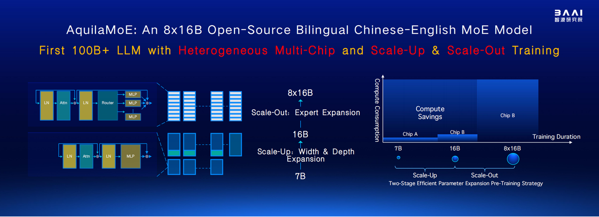
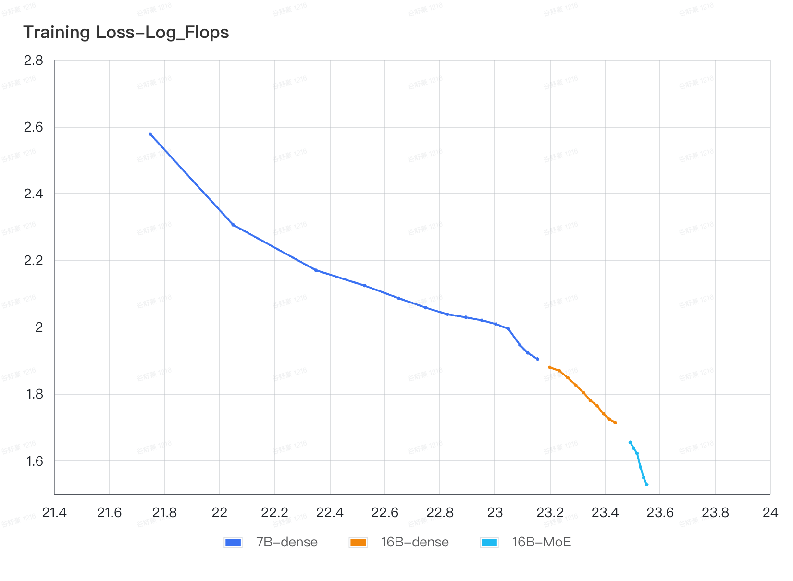
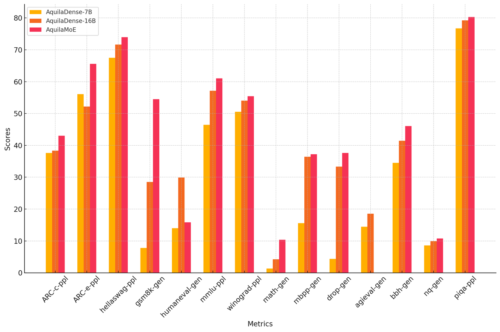

# AquilaMoE: Efficient Training for MoE Models with Scale-Up and Scale-Out Strategies
<p align="center">
    <br>
    <strong>Language Foundation Model & Software Team</strong> <br>
    <strong>Beijing Academy of Artificial Intelligence (BAAI)</strong>
    <br><br>
    
    <br><br>
    [Paper] [Code] [🤗] (would be released soon)
</p>


We present **AquilaMoE**, a cutting-edge bilingual 8\*16B Mixture of Experts (MoE) language model developed using an innovative training methodology called EfficientScale. This approach optimizes performance while minimizing data requirements through a two-stage process. The first stage, termed Scale-Up, initializes the larger model with weights from a pre-trained smaller model, enabling substantial knowledge transfer and continuous pretraining with significantly less data. The second stage, Scale-Out, uses a pre-trained dense model to initialize the MoE experts, further enhancing knowledge transfer and performance. Extensive validation experiments on 1.8B and 7B models compared various initialization schemes, achieving models that maintain and reduce loss during continuous pretraining. Utilizing the optimal scheme, we successfully trained a 16B model and subsequently the 8\*16B AquilaMoE model, demonstrating significant improvements in performance and training efficiency.

## Training Details

### Datasets

We constructed a bilingual pretraining dataset of 4TB tokens in both Chinese and English. This dataset includes webpages, arXiv papers, encyclopedic data, books, codes, and QA pairs. It covers a wide range of high-quality open-source pretraining data such as RedPajama-Data-V2, falcon-refinedweb, C4, Pile, WuDaoCorporaText, ChineseWebText, etc. The above open-source data underwent language filtering to retain only Chinese and English texts, heuristic refinement to remove low-quality content, deduplication to maintain uniqueness, domain-specific filtering for relevance, data quality checks, removal of toxic and explicit content, and finally, data mixing in specified proportions.

### Model Configurations

|                            | Aquila3 7B | Aquila3 16B | Aquila3 8x16B |
|----------------------------|------------|-------------|---------------|
| Context Length             | 4096       | 4096        | 4096          |
| QKV Bias                   | yes        | yes         | yes           |
| Layers                     | 32         | 40          | 40            |
| Hidden Dim                 | 4096       | 5120        | 5120          |
| Intermediate Dim           | 14336      | 20480       | 20480         |
| KV Group                   | 8          | 8           | 8             |
| Trained Tokens             | 3.6T       | 1.2T        | 545B          |
| LR                         | 1.2e-3     | 4e-4        | 1.5e-4        |
| Batch Size                 | 12M        | 12M         | 24M           |


### Training Procedures

The EfficientScale pipeline efficiently trains a large-scale Mixture of Experts (MoE) model by leveraging knowledge transfer from smaller models. It consists of three key phases: Preparation, Scale-Up, and Scale-Out, each ensuring effective knowledge transfer and continuous learning for an optimized MoE model.

#### 1. Preparation Phase

In the preparation phase, a small dense model is trained, and datasets are prepared for the following stages. This phase ensures the initial model has adequate transferable knowledge and that data is ready for effective training and validation.

- **Model Preparation**: Train a small dense model from scratch on a large number of tokens or use a pre-trained small model. This step ensures the model accumulates sufficient transferable knowledge to serve as a strong foundation.
- **Data Preparation**: Collect, clean, and preprocess the training and validation datasets. This step ensures the data is suitable for effective training and validation.
- **Validation Setup**: Develop training and validation datasets to monitor model performance. Continuous tracking of the model's loss on the validation dataset ensures the initialized models retain transferred knowledge and effectively learn new information.

#### 2. Scale-Up Phase

The Scale-Up phase involves initializing a larger dense model with the weights from a smaller model and performing continuous pretraining to enhance performance.

- **Weight Initialization Strategies**: the weights from a small dense model are used to initialize a larger dense model using three strategies:
  - **Function Preserving Initialization (FPI)**: Expands the model's width while preserving the same output, ensuring knowledge transfer from the smaller model [1].
  - **Advanced Knowledge Initialization (AKI)**: Addresses symmetry issues in FPI by incorporating weights from both the same and upper layers of the smaller model and uses stacking for depth expansion [2].
  - **AKI-Pro**: Improves AKI with two refinements:
    1. **Interpolation for Depth Growth**: Uses interpolation instead of stacking for stable continuous training [3].
    2. **GQA Compatibility**: Adapts AKI for Group Query Attention models.
- **Continuous Pretraining Process**: the scaled-up dense model undergoes continuous pretraining on a large amount of tokens, ensuring effective knowledge transfer and improved performance.

#### 3. Scale-Out Phase

The scale-out phase transforms a large dense model into a Mixture of Experts (MoE) model, including initializing MoE weights and continuous pretraining to enhance performance.

- **MoE Weight Initialization**: Aquila-MoE is initialized using Sparse Upcycling [4, 5]. The dense model's MLP layers are replaced with MoE layers, exact replicas of the original, with router parameters initialized normally (mean = 0, variance = 0.02).
- **Continuous Pretraining of MoE**: During training and inference, two of eight experts are activated per token, utilizing about 30B parameters. To prevent training collapse, load balancing loss [6] and max z-loss [7, 8] are applied, scaled by 0.001 and 0.01, respectively, ensuring balanced token distribution and stable training.

EfficientScale enables efficient large-scale model training by leveraging pre-trained smaller models, reducing data and computational needs, and ensuring effective knowledge transfer and continuous learning.

### References

[1] Chen, T., Goodfellow, I., & Shlens, J. (2016). Net2net: Accelerating learning via knowledge transfer. In Proceedings of ICLR 2016.  
[2] Chen, C., Yin, Y., Shang, L., Jiang, X., Qin, Y., Wang, F., Wang, Z., Chen, X., Liu, Z., & Liu, Q. (2022). bert2BERT: Towards reusable pretrained language models. In Proceedings of ACL 2022.  
[3] Pan, Y., Yuan, Y., Yin, Y., Shi, J., Xu, Z., Zhang, M., Shang, L., Jiang, X., & Liu, Q. (2024). Preparing lessons for progressive training on language models. arXiv:2401.09192.  
[4] Komatsuzaki, A., Puigcerver, J., Lee-Thorp, J., Riquelme Ruiz, C., Mustafa, B., Ainslie, J., Tay, Y., Dehghani, M., & Houlsby, N. (2022). Sparse upcycling: Training mixture-of-experts from dense checkpoints. arXiv:2212.05055.  
[5] Hu, S., Tu, Y., Han, X., He, C., Cui, G., Long, X., Zheng, Z., Fang, Y., Huang, Y., Zhao, W., et al. (2024). Minicpm: Unveiling the potential of small language models with scalable training strategies. arXiv:2404.  
[6] Fedus, W., Zoph, B., & Shazeer, N. (2022). Switch transformers: Scaling to trillion parameter models with simple and efficient sparsity. JMLR, 23(120), 1–39.  
[7] Chowdhery, A., Narang, S., Devlin, J., Bosma, M., Mishra, G., Roberts, A., Barham, P., Chung, H. W., Sutton, C., Gehrmann, S., et al. (2023). Palm: Scaling language modeling with pathways. JMLR, 24(240), 1–113.  
[8] Zoph, B., Bello, I., Kumar, S., Du, N., Huang, Y., Dean, J., Shazeer, N., & Fedus, W. (2022). St-moe: Designing stable and transferable sparse expert models. arXiv:2202.08906.

### Training Loss

The plot illustrates the training loss versus log FLOPs for the three stages of model training: AquilaDense-7B, AquilaDense-16B, and AquilaMoE.

1. **Each Stage's Decrease**: Throughout the training process, we observe a steady decrease in training loss as log FLOPs increase for each stage. The AquilaDense-7B (blue line) stage shows a gradual reduction in loss, followed by the AquilaDense-16B (orange line) stage, which continues the trend.
2. **Quick Recovery at Transition Points**: When transitioning from AquilaDense-7B to AquilaDense-16B, and from AquilaDense-16B to AquilaMoE (light blue line), the training loss quickly recovers to the range of the previous stage with minimal additional compute. This indicates that each new stage rapidly achieves the performance level of the preceding stage before further improvements.
3. **Increasing Slope**: A notable observation is that the slope of the training loss curve becomes progressively steeper with each stage, indicating an increasingly efficient reduction in training loss. This means that as the model scales and transitions from one stage to the next, the efficiency of training improves, resulting in faster decreases in training loss.

This plot effectively demonstrates the combined benefits of continuous loss reduction, quick recovery at stage transitions, and increasing efficiency in training.  
<p align="center">

<p>


### Performance

The performance of the AquilaMoE model series improves significantly across multiple tasks as the parameter size increases. Both scale-up and scale-out strategies are highly effective in enhancing model performance.
<p align="center">

<p>
    
#### Foundation Models
    
| Model            | AquilaDense-7B | AquilaDense-16B | AquilaMoE |
|------------------|----------------|-----------------|-----------|
| ARC-c-ppl        | 37.63          | 38.31           | 43.05     |
| ARC-e-ppl        | 56.08          | 52.2            | 65.61     |
| hellaswag-ppl    | 67.49          | 71.62           | 73.94     |
| gsm8k-gen        | 7.81           | 28.51           | 54.51     |
| humaneval-gen    | 14.02          | 29.88           | 15.85     |
| mmlu-ppl         | 46.47          | 57.11           | 61        |
| winograd-ppl     | 50.53          | 54.04           | 55.4      |
| math-gen         | 1.32           | 4.24            | 10.4      |
| mbpp-gen         | 15.6           | 36.4            | 37.2      |
| drop-gen         | 4.35           | 33.35           | 37.62     |
| agieval-gen      | 14.47          | 18.57           | -          |
| bbh-gen          | 34.51          | 41.45           | 46.04     |
| nq-gen           | 8.61           | 9.94            | 10.78     |
| piqa-ppl         | 76.71          | 79.22           | 80.3      |

*Table: Overall evaluation results of AquilaDense and AquilaMoE (AquilaMoE-8\*16B).*

#### Fine-tuned AquilaMoE

| Model            | AquilaMoE-SFT |
|------------------|---------------|
| ARC-c-ppl        | 49.15         |
| ARC-e-ppl        | 69.49         |
| hellaswag-ppl    | 69.77         |
| gsm8k-gen        | 71.27         |
| humaneval-gen    | 40.24         |
| mmlu-ppl         | 59.93         |
| winograd-ppl     | 57.5          |

*Table: Performance of AquilaMoE-SFT (16\*8B) on various benchmarks.*

## License Agreement

The AquilaMoE project is based on the Apache 2.0 license; The AquilaMoE series models are based on the [BAAI Aquila Model License Agreement](./assets/aquila_license.pdf).

## Limitations

The AquilaMoE Instruct model is a quick demonstration that the base model can be easily fine-tuned to achieve compelling performance. It does not have any moderation mechanisms. We're looking forward to engaging with the community on ways to make the model finely respect guardrails, allowing for deployment in environments requiring moderated outputs.

## Contact Us

If you are interested, please join our WeChat groups!


## Citation

Our paper, detailing the efficient training methods for MoE models using Scale-Up and Scale-Out strategies, will be released soon on arXiv. Stay tuned!

```bibtex
@article{AquilaMoE2024,
  title={AquilaMoE: Efficient Training for MoE Models with Scale-Up and Scale-Out Strategies},
  author={{Language Foundation Model \& Software Team, Beijing Academy of Artificial Intelligence (BAAI)}},
  journal={arXiv preprint arXiv:2406.XXXX},
  year={2024}
}
